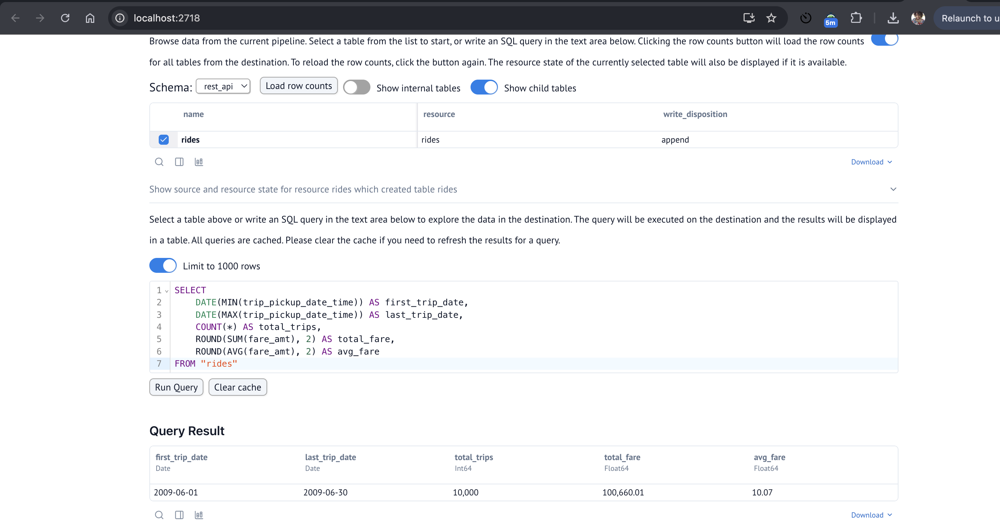
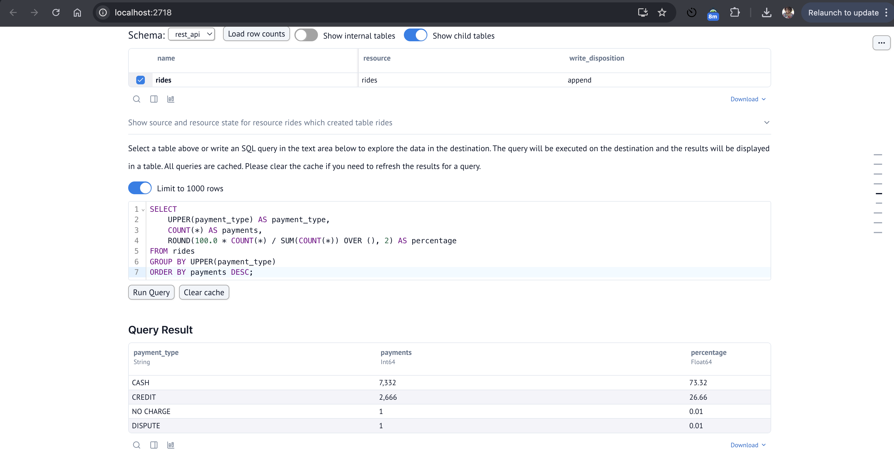
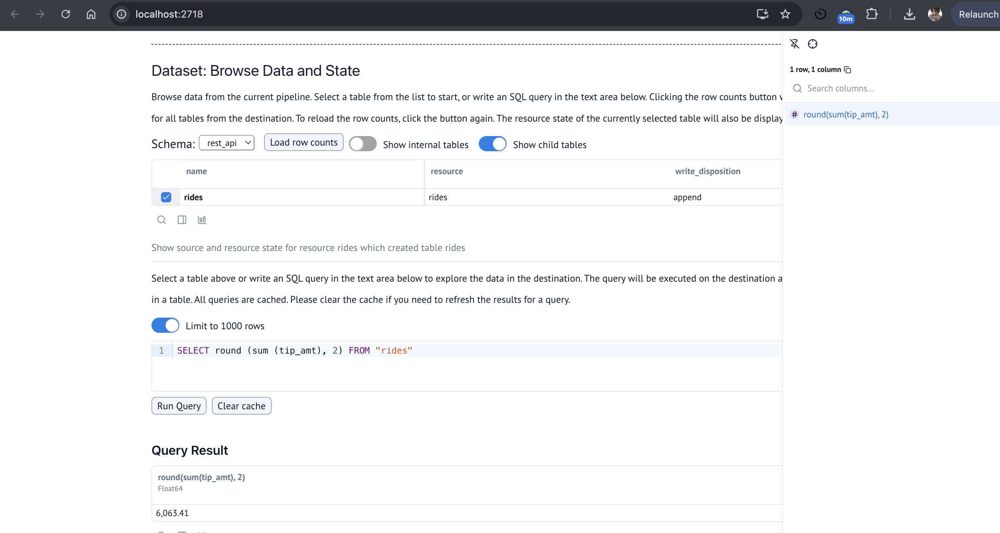

---

## Questions

Once your pipeline has run successfully, use the methods covered in the workshop to investigate the following:

- **dlt Dashboard**: `dlt pipeline taxi_pipeline show`
- **dlt MCP Server**: Ask the agent questions about your pipeline
- **Marimo Notebook**: Build visualizations and run queries

We challenge you to try out the different methods explored in the workshop when answering these questions to see what works best for you. Feel free to share your thoughts on what worked (or didn't) in your submission!

### Question 1: What is the start date and end date of the dataset?

- 2009-01-01 to 2009-01-31
- 2009-06-01 to 2009-07-01
- 2024-01-01 to 2024-02-01
- 2024-06-01 to 2024-07-01

Answer: - 2009-06-01 to 2009-07-01

### Question 2: What proportion of trips are paid with credit card?

- 16.66%
- 26.66%
- 36.66%
- 46.66%

Answer : - 26.66%

### Question 3: What is the total amount of money generated in tips?

- $4,063.41
- $6,063.41
- $8,063.41
- $10,063.41

Answer - - $6,063.41

