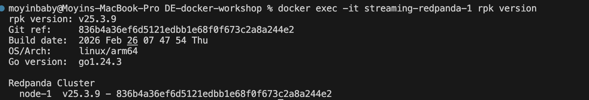
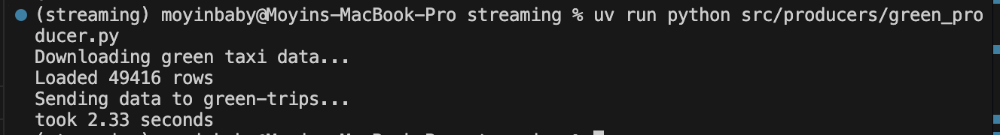
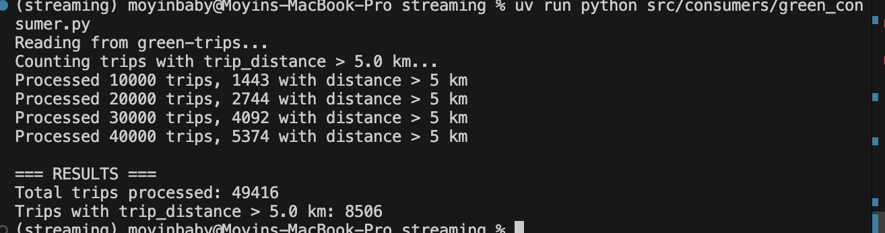
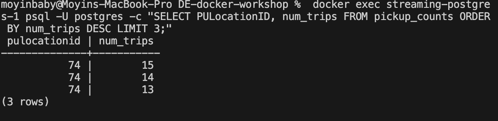
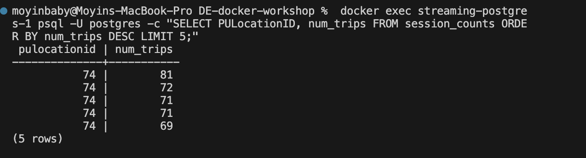
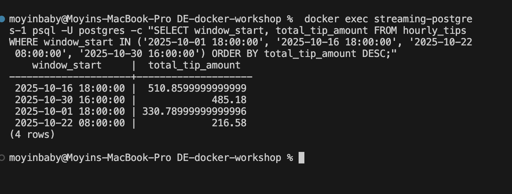

# Homework

In this homework, we'll practice streaming with Kafka (Redpanda) and PyFlink.

We use Redpanda, a drop-in replacement for Kafka. It implements the same
protocol, so any Kafka client library works with it unchanged.

For this homework we will be using Green Taxi Trip data from October 2025:

- [green_tripdata_2025-10.parquet](https://d37ci6vzurychx.cloudfront.net/trip-data/green_tripdata_2025-10.parquet)


## Question 1. Redpanda version

Run `rpk version` inside the Redpanda container:

```bash
docker exec -it workshop-redpanda-1 rpk version
```

What version of Redpanda are you running?
Answer : v25.3.9



## Question 2. Sending data to Redpanda

Create a topic called `green-trips`:

```bash
docker exec -it workshop-redpanda-1 rpk topic create green-trips
```

Measure the time it takes to send the entire dataset and flush:

```python
from time import time

t0 = time()

# send all rows ...

producer.flush()

t1 = time()
print(f'took {(t1 - t0):.2f} seconds')
```

How long did it take to send the data?

- 10 seconds
- 60 seconds
- 120 seconds
- 300 seconds

Answer - 10 seconds 




## Question 3. Consumer - trip distance

Write a Kafka consumer that reads all messages from the `green-trips` topic
(set `auto_offset_reset='earliest'`).

Count how many trips have a `trip_distance` greater than 5.0 kilometers.

How many trips have `trip_distance` > 5?

- 6506
- 7506
- 8506
- 9506

Answer - 8506




## Part 2: PyFlink (Questions 4-6)

For the PyFlink questions, you'll adapt the workshop code to work with
the green taxi data. The key differences from the workshop:

- Topic name: `green-trips` (instead of `rides`)
- Datetime columns use `lpep_` prefix (instead of `tpep_`)
- You'll need to handle timestamps as strings (not epoch milliseconds)

You can convert string timestamps to Flink timestamps in your source DDL:

```sql
lpep_pickup_datetime VARCHAR,
event_timestamp AS TO_TIMESTAMP(lpep_pickup_datetime, 'yyyy-MM-dd HH:mm:ss'),
WATERMARK FOR event_timestamp AS event_timestamp - INTERVAL '5' SECOND
```


## Question 4. Tumbling window - pickup location

Create a Flink job that reads from `green-trips` and uses a 5-minute
tumbling window to count trips per `PULocationID`.

Write the results to a PostgreSQL table with columns:
`window_start`, `PULocationID`, `num_trips`.

After the job processes all data, query the results:

```sql
SELECT PULocationID, num_trips
FROM <your_table>
ORDER BY num_trips DESC
LIMIT 3;
```

Which `PULocationID` had the most trips in a single 5-minute window?

- 42
- 74
- 75
- 166

Answer - 74




## Question 5. Session window - longest streak

Create another Flink job that uses a session window with a 5-minute gap
on `PULocationID`, using `lpep_pickup_datetime` as the event time
with a 5-second watermark tolerance.

A session window groups events that arrive within 5 minutes of each other.
When there's a gap of more than 5 minutes, the window closes.

Write the results to a PostgreSQL table and find the `PULocationID`
with the longest session (most trips in a single session).

How many trips were in the longest session?

- 12
- 31
- 51
- 81

Answer - 81




## Question 6. Tumbling window - largest tip

Create a Flink job that uses a 1-hour tumbling window to compute the
total `tip_amount` per hour (across all locations).

Which hour had the highest total tip amount?

- 2025-10-01 18:00:00
- 2025-10-16 18:00:00
- 2025-10-22 08:00:00
- 2025-10-30 16:00:00

Answer -  2025-10-16 18:00:00




## Submitting the solutions

- Form for submitting: https://courses.datatalks.club/de-zoomcamp-2026/homework/hw7


```

## Example post for Twitter/X

```
Module 7 of Data Engineering Zoomcamp done!

- Kafka producers and consumers
- PyFlink tumbling and session windows
- Real-time taxi data analysis
- Redpanda as Kafka replacement

My solution: <LINK>

Free course by @DataTalksClub: https://github.com/DataTalksClub/data-engineering-zoomcamp/
```