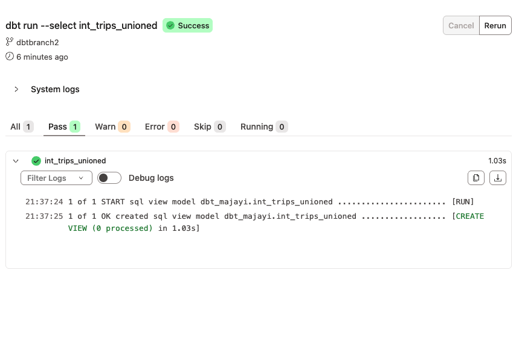
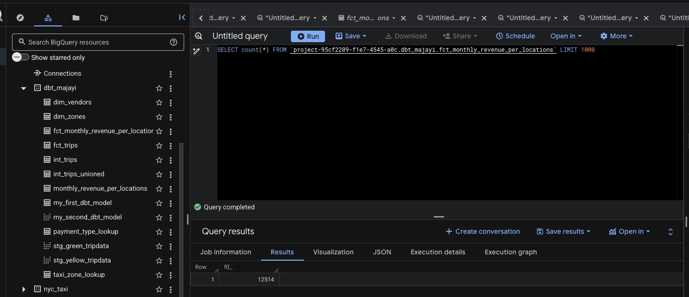
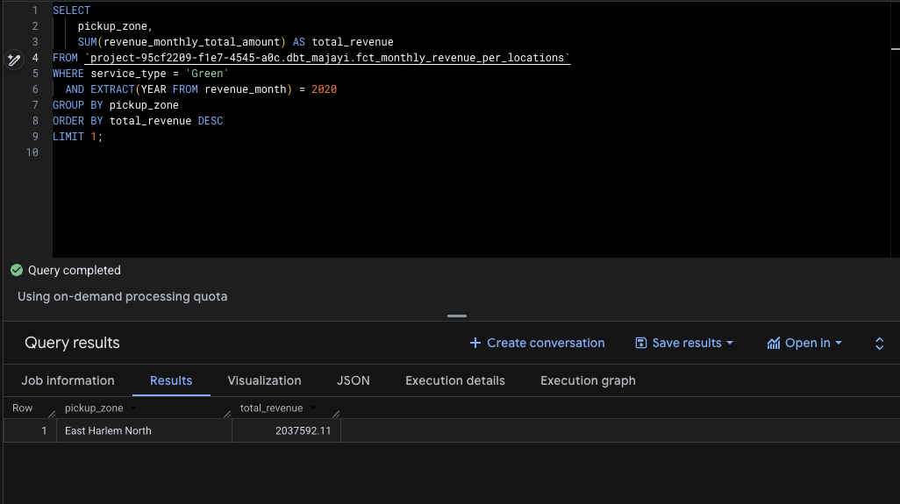
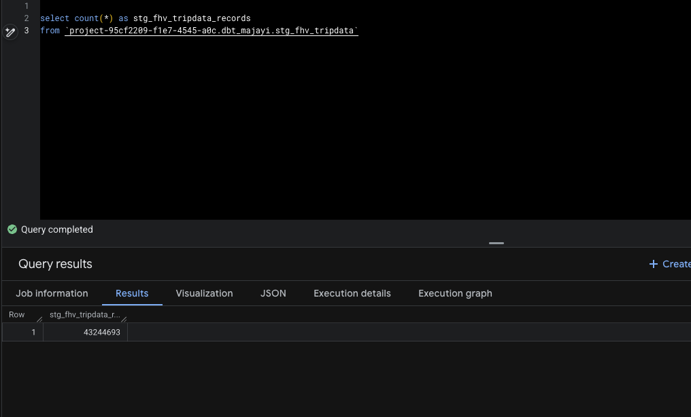

# Module 4 Homework: Analytics Engineering with dbt

In this homework, we'll use the dbt project in `04-analytics-engineering/taxi_rides_ny/` to transform NYC taxi data and answer questions by querying the models.

## Setup

1. Set up your dbt project following the [setup guide](../../../04-analytics-engineering/setup/)
2. Load the Green and Yellow taxi data for 2019-2020 into your warehouse
3. Run `dbt build --target prod` to create all models and run tests

> **Note:** By default, dbt uses the `dev` target. You must use `--target prod` to build the models in the production dataset, which is required for the homework queries below.

After a successful build, you should have models like `fct_trips`, `dim_zones`, and `fct_monthly_zone_revenue` in your warehouse.

---

### Question 1. dbt Lineage and Execution

Given a dbt project with the following structure:

```
models/
├── staging/
│   ├── stg_green_tripdata.sql
│   └── stg_yellow_tripdata.sql
└── intermediate/
    └── int_trips_unioned.sql (depends on stg_green_tripdata & stg_yellow_tripdata)
```

If you run `dbt run --select int_trips_unioned`, what models will be built?

Answer - `stg_green_tripdata`, `stg_yellow_tripdata`, and `int_trips_unioned` (upstream dependencies)




---

### Question 2. dbt Tests

You've configured a generic test like this in your `schema.yml`:

```yaml
columns:
  - name: payment_type
    data_tests:
      - accepted_values:
          arguments:
            values: [1, 2, 3, 4, 5]
            quote: false
```

Your model `fct_trips` has been running successfully for months. A new value `6` now appears in the source data.

What happens when you run `dbt test --select fct_trips`?

answer - dbt will fail the test, returning a non-zero exit code

---

### Question 3. Counting Records in `fct_monthly_zone_revenue`

After running your dbt project, query the `fct_monthly_zone_revenue` model.

What is the count of records in the `fct_monthly_zone_revenue` model?


Answer  closest- 12,184




---

### Question 4. Best Performing Zone for Green Taxis (2020)

Using the `fct_monthly_zone_revenue` table, find the pickup zone with the **highest total revenue** (`revenue_monthly_total_amount`) for **Green** taxi trips in 2020.

Which zone had the highest revenue?

Answer - East Harlem North



---

### Question 5. Green Taxi Trip Counts (October 2019)

Using the `fct_monthly_zone_revenue` table, what is the **total number of trips** (`total_monthly_trips`) for Green taxis in October 2019?

Answer
- 421,509


---

### Question 6. Build a Staging Model for FHV Data

Create a staging model for the **For-Hire Vehicle (FHV)** trip data for 2019.

1. Load the [FHV trip data for 2019](https://github.com/DataTalksClub/nyc-tlc-data/releases/tag/fhv) into your data warehouse
2. Create a staging model `stg_fhv_tripdata` with these requirements:
   - Filter out records where `dispatching_base_num IS NULL`
   - Rename fields to match your project's naming conventions (e.g., `PUlocationID` → `pickup_location_id`)

What is the count of records in `stg_fhv_tripdata`?

-Answer:
- 43,244,693



---

## Submitting the solutions

- Form for submitting: <https://courses.datatalks.club/de-zoomcamp-2026/homework/hw4>

=======

## Learning in Public

We encourage everyone to share what they learned. This is called "learning in public".

Read more about the benefits [here](https://alexeyondata.substack.com/p/benefits-of-learning-in-public-and).

### Example post for LinkedIn

```
🚀 Week 4 of Data Engineering Zoomcamp by @DataTalksClub complete!

Just finished Module 4 - Analytics Engineering with dbt. Learned how to:

✅ Build transformation models with dbt
✅ Create staging, intermediate, and fact tables
✅ Write tests to ensure data quality
✅ Understand lineage and model dependencies
✅ Analyze revenue patterns across NYC zones

Transforming raw data into analytics-ready models - the T in ELT!

Here's my homework solution: <LINK>

Following along with this amazing free course - who else is learning data engineering?

You can sign up here: https://github.com/DataTalksClub/data-engineering-zoomcamp/
```

### Example post for Twitter/X

```
📈 Module 4 of Data Engineering Zoomcamp done!

- Analytics Engineering with dbt
- Transformation models & tests
- Data lineage & dependencies
- NYC taxi revenue analysis

My solution: <LINK>

Free course by @DataTalksClub: https://github.com/DataTalksClub/data-engineering-zoomcamp/
```